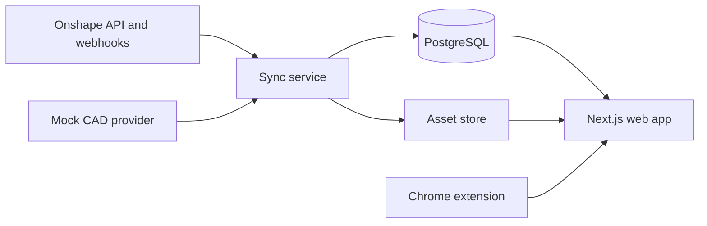

# Onshape 3D CAD Visualizer

An engineering-oriented web platform for presenting Onshape assemblies, documenting their components, and reviewing CAD revision changes. The MVP is implemented as a TypeScript monorepo with a Next.js viewer/admin application, PostgreSQL-backed domain model, mock CAD provider, and an Onshape integration boundary.

The repository can be developed in mock mode without Onshape credentials. Onshape credentials are intended to remain server-side when live integration is enabled.

## Current Status

The foundation, mock CAD data, initial API routes, viewer surfaces, and PostgreSQL Docker configuration are present. Active implementation is currently repairing the web viewer's TypeScript boundaries before continuing with additional MVP slices. The most recent status is kept in [docs/progress](docs/progress).

## Architecture



## Repository Layout

```text
apps/
  web/                 Next.js public viewer, admin UI, and API routes
packages/
  cad-core/            CAD-provider contracts and mock provider
  database/            Database schema and query layer
  shared/              Shared domain types
fixtures/
  mock-cad/            Mock assembly and revision fixture data
docs/
  progress/            Timestamped implementation records
```

## Prerequisites

- Node.js 18.18 or newer
- pnpm 9
- Docker Desktop, for the local PostgreSQL service

## Local Development

```bash
cp .env.example .env
docker compose up -d
pnpm install
pnpm --workspace @app/web dev
```

Open `http://localhost:3000` after the Next.js development server starts.

The repository declares root convenience scripts, but use package-scoped commands while the Turbo task migration is being completed:

```bash
pnpm --workspace @app/web typecheck
pnpm --workspace @app/web build
pnpm --workspace @app/web lint
```

## Mock Mode

The mock provider in `packages/cad-core/mock-cad-provider.ts` and fixtures under `fixtures/mock-cad/` supply assembly/component data without any external service. This supports viewer and revision-workflow development without configuring Onshape access.

## Configuration

Copy `.env.example` to `.env`. It documents the PostgreSQL URL, application URL, Onshape server-side credentials, asset-store settings, S3 settings, and webhook secret. Do not expose Onshape credentials in the browser or extension.

## Onshape Integration

Live Onshape synchronization remains a server-side concern. Configure `ONSHAPE_BASE_URL`, the selected authentication mode, and the relevant server-only credential variables in `.env`. The project is designed to keep CAD-derived data separate from human-authored component documentation so synchronization does not overwrite authored content.

## Progress Records

Each completed autonomous implementation slice must create a timestamped Markdown record in `docs/progress/`. The record names the stage, files or behavior changed, validation performed, remaining failure state when applicable, and the next concrete slice.

## Notes

The detailed product requirements and implementation constraints are in [AGENTS.md](AGENTS.md). The legacy [DEV_STATUS.md](DEV_STATUS.md) is historical; prefer timestamped entries in `docs/progress/` for the current state.